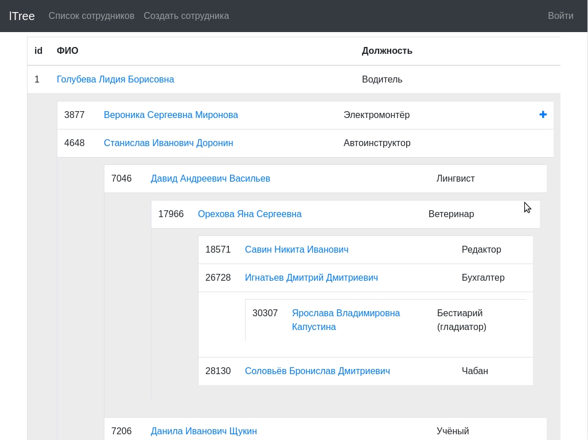

## About lTree

lTree is a employee directory for a company with more than 50,000 employees.

1. lTree displays the hierarchy of employees in the tree form.
    - 1.1 Information about each employee is stored in the database
    - 1.2 Each employee has 1 boss
    - 1.3 The database contains at least 50,000 employees and 5 levels hierarchies
    - 1.4 Display the position of the employee

2. Functional
    - 2.1 Database using Laravel migration
    - 2.2 Database using Laravel seeder to fill the database
    - 2.3 Bootstrap v4.1.2
    - 2.4 The list of employees with all information from the database and the ability to sort by any field
    - 2.5 The ability to search employees for any field
    - 2.6 Еhe ability to sort and search by any field without reloading the page, using ajax.
    - 2.7 Basic auth
    - 2.8 The functional developed in item 4, 5 and 6 accessible only to registered users.
    - 2.9 CRUD operations for employee records
    - 2.10 The ability to upload a photo employee
    - 2.11 The possibility of redeployment of staff in case of change of chief (Through Relationships)
    - 2.12 Lazy loading for employee tree (load the next 2 levels)

## Technical requirements

- [Laravel](https://laravel.com/docs/5.4/installation#server-requirements) ​>=5.4
- MySQL >=​5.6
- PHP >=​5.6

## Install

1. Create a database (utf8_general_ci) named `ltree`
2. Run in terminal
```bash
cd PUBLIC_DIR
git clone https://github.com/13338/ltree.git
cd ltree
composer install
cp .env.example .env
php artisan key:generate
```
3. Fill the database information (`DB_DATABASE`, `DB_USERNAME`, `DB_PASSWORD`...) in `.env` file
migrate with seed
```bash
php artisan migrate --seed
```
or without
```bash
php artisan migrate
```
4. Run
```bash
php artisan serve --port=13338
```

**You can now access your project at [localhost:13338](http://localhost:13338/login?email=admin@admin.com&password=admin@admin.com). Enjoy! :)**

## License

The lTree is open-sourced software licensed under the [MIT license](http://opensource.org/licenses/MIT).
